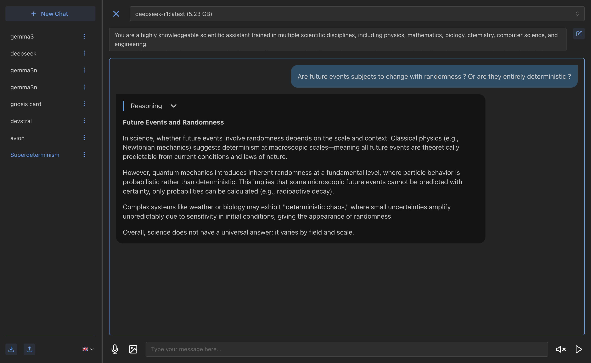

# OllamaChat

`OllamaChat` is an interactive user interface based on React and TypeScript, designed to interact with local language models via Ollama and integrate real-time voice transcription. This project offers a smooth chat experience with advanced features like audio transcription, voice playback of model responses, and document management.

## Overview


*Screenshot of the main OllamaChat interface.*

## Features

*   **Chat with Ollama:** Interact with local LLM via Ollama.
*   **Import/Export Sessions:** Save and restore your chat sessions in JSON format, allowing for easy sharing or archiving.
*   **Voice Transcription (STT):** Record your voice and have it transcribed into text via a dedicated backend (like `ChatServer`).
*   **Text-to-Speech (TTS):** The model's responses are read aloud for a more immersive experience.
*   **Document Management:** Attach documents to your requests for the model to analyze.
*   **Internationalization (i18n):** The interface is available in multiple languages thanks to `i18next`.
*   **Markdown Rendering:** The model's responses are formatted in Markdown for rich display (lists, code, etc.). Reasoning is collapsable.
*   **Customizable System Prompt:** Define a custom system prompt to guide the model's behavior.
*   **Strong Typing (TypeScript):** The project is fully typed for better maintainability and early error detection.

## Technologies Used

*   **React:** A JavaScript library for building user interfaces.
*   **Vite:** A fast frontend build tool.
*   **Mantine:** A React component library for an elegant UI.
*   **Ollama JS:** A JavaScript client for interacting with Ollama models.
*   **i18next:** An internationalization framework for React.
*   **React Markdown:** For rendering model responses in Markdown.
*   **Web Speech API:** For audio recording (`getUserMedia`) and speech synthesis (`SpeechSynthesis`).

## Prerequisites

Before starting the application, ensure you have the following:

*   **Node.js (version 18 or higher recommended)**
*   **npm** or **Yarn** (package manager)
*   **A running Ollama server** with the models of your choice (e.g., `ollama pull mistral`).
*   **The `ChatServer` backend running** (for voice transcription).

## Installation and Startup

Follow these steps to set up and launch the application:

1.  **Navigate to the project directory:**
    ```bash
    cd ./OllamaChat
    ```

2.  **Install dependencies:**
    ```bash
    npm install
    # or
    yarn install
    ```

3.  **Configure the transcription server URL:**
    Create a `.env` file at the root of the project (`/Users/victor/Projets/AnswR/OllamaChat/.env`) and add the URL of your `ChatServer` backend:
    ```
    VITE_OLLAMA_URL=http://127.0.0.1:11434
    VITE_SERVER_URL=http://127.0.0.1:8000
    ```
    *(Make sure this URL matches the address where your `ChatServer` is running.)*

4.  **Start the development server:**
    ```bash
    npm run dev
    # or
    yarn dev
    ```
    The application will be accessible at `http://localhost:5173` (or another port if specified by Vite).

## Usage

*   **Model Selection:** Choose the Ollama model you want to interact with via the selector at the top.
*   **Text Input:** Type your questions in the text box and press `Enter` to send.
*   **Voice Transcription:** Click the microphone icon to record your voice. The transcribed text will appear in the input box and be sent to the model.
*   **Text-to-Speech:** Enable/disable the reading of model responses via the volume icon. If a reading is in progress, clicking the icon will stop it.
*   **Adding Documents:** Use the image icon to attach a file. Its content will be added to your prompt. (Right now, only images are considered).

## Project Structure

*   `src/App.tsx`: The root component of the application.
*   `src/components/`: Contains reusable components:
    *   `Chat.tsx`: Displays the current conversation.
    *   `ChatBubble.tsx`: Represents a message bubble in the chat.
    *   `ChatList.tsx`: Manages the list of conversations.
    *   `Collapsable.tsx`: A reusable accordion component.
    *   `DocumentPicker.tsx`: Allows selecting documents to attach.
    *   `LanguageSwitcher.tsx`: Allows changing the interface language.
    *   `LLMPicker.tsx`: Allows selecting the language model.
    *   `Question.tsx`: The input area for asking questions.
    *   `Record.tsx`: Manages audio recording.
    *   `SystemPrompt.tsx`: Allows setting a system prompt.
*   `src/context/`: Manages React contexts for state sharing:
    *   `AppProviders.tsx`: A component that wraps all context providers.
    *   `MessageContext.tsx`: Manages messages in the active conversation.
    *   `ModelContext.tsx`: Manages the selected language model.
    *   `OllamaContext.tsx`: Manages the connection with the Ollama server.
*   `src/hooks/`: Contains custom hooks:
    *   `useTts.ts`: Manages Text-to-Speech.
*   `src/locales/`: Contains translation files for internationalization.
*   `src/models/`: TypeScript type definitions.
*   `src/utils/`: Utility functions.

## Development

The project uses Vite for rapid development. The key commands are:

*   `npm run dev`: Starts the development server.
*   `npm run build`: Compiles the application for production.
*   `npm run lint`: Runs ESLint to check the code.
*   `npm run preview`: Previews the production build.

## Notes

*   In development mode, you might observe some side effects (like duplicate logs) due to React's `StrictMode`. This behavior is normal and does not affect the production version.
*   Ensure that your Ollama server is accessible from the URL configured in `VITE_OLLAMA_URL` in your `.env` file.