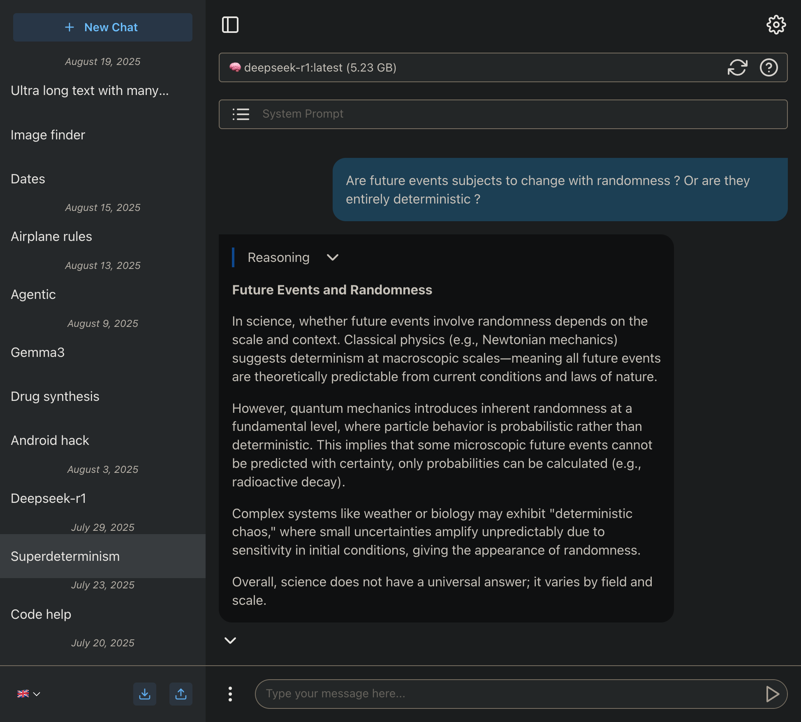
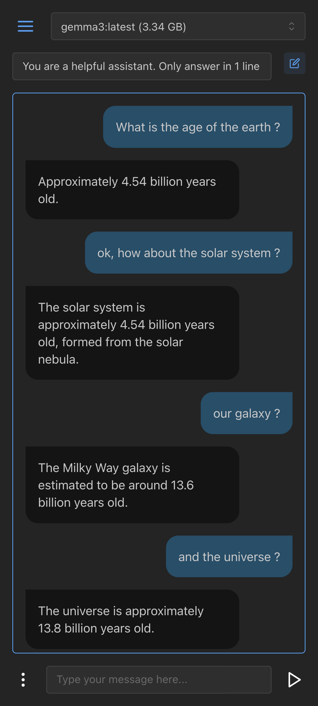

# OllamaChat

`OllamaChat` is an interactive user interface built with Next.js, React, and TypeScript, designed to interact with local language models via Ollama. This project offers a smooth chat experience with advanced features like audio transcription, voice playback of model responses, and image analysis.

## Overview (desktop & mobile)




## Features

*   **Chat with Ollama:** Interact with any local LLM available through Ollama.
*   **Multi-Session Management:** Your chat history is saved and organized into distinct sessions.
*   **Import/Export Sessions:** Save and restore your chat sessions in JSON format.
*   **Voice Transcription (STT):** Record your voice to have it transcribed as text input.
*   **Text-to-Speech (TTS):** Model responses are read aloud for a more immersive experience.
*   **Image Analysis:** Attach images to your prompts for vision-capable models to analyze.
*   **Internationalization (i18n):** The interface is available in multiple languages.
*   **Markdown & Collapsible Reasoning:** Responses are rendered in Markdown, with `<think>` tags automatically displayed in a collapsible section.
*   **Customizable System Prompt:** Define a custom system prompt to guide the model's behavior, with presets available.
*   **LLM Capabilities Display:** The UI shows the capabilities of each LLM (e.g., vision) to help you choose the right model.

## Tech Stack

*   **Next.js:** A React framework for building full-stack web applications.
*   **React & TypeScript:** For building the user interface with strong typing.
*   **Mantine:** A React component library for an elegant UI.
*   **React Feather:** For icons.
*   **Ollama JS:** A JavaScript client for interacting with Ollama models.
*   **i18next:** An internationalization framework.

## Architecture

This project is built on the **Next.js App Router**, which uses **Server Components** by default for performance and fetches data on the server. Interactive parts of the UI are explicitly marked as **Client Components** (`'use client'`).

- **Server Actions** (`src/app/actions.ts`) are used to securely fetch data from the Ollama server without exposing it to the client.
- **API Routes** (`src/app/api/`) are used to act as a secure proxy between the client and external backends. This is used for the voice transcription service to avoid CORS issues and hide the backend URL.

## Prerequisites

Before starting, ensure you have the following:

*   **Node.js** (version 18 or higher recommended)
*   **npm** (or another package manager like yarn, pnpm)
*   **A running Ollama server** with your desired models (e.g., `ollama pull mistral`).
*   **A running Python backend for transcription.** The one this UI was designed for is available at [https://github.com/vaccarov/ChatServer](https://github.com/vaccarov/ChatServer).

## Installation and Startup

1.  **Clone the repository:**
    ```bash
    git clone https://github.com/vaccarov/OllamaChat
    cd OllamaChat
    ```

2.  **Install dependencies:**
    ```bash
    npm install
    ```

3.  **Configure environment variables:**
    Create a `.env.local` file at the root of the project and add the following variables. This file should **not** be committed to Git.
    ```env
    NEXT_PUBLIC_HOST=localhost
    NEXT_PUBLIC_OLLAMA_PORT=11434

    # (Optional) The URL/port for your Audio transcription server
    NEXT_PUBLIC_SERVER_HOST=http://localhost
    NEXT_PUBLIC_SERVER_PORT=8000

    # (Optional) The public Next.js https URL (I'm using tailscale but it could be your VPS server). This is mandatory if you want to use audio recording from your phone, since https is required for audio record permissions.
    NEXT_PUBLIC_TAILSCALE_HOST=XXX
    ```

4.  **Run the development server:**
    ```bash
    npm run dev
    ```
    The application will be accessible at [http://localhost:3000](http://localhost:3000).

## Development Scripts

*   `npm run dev`: Starts the development server.
*   `npm run build`: Compiles the application for production.
*   `npm run start`: Starts the production server.
*   `npm run lint`: Runs ESLint to check for code quality issues.

## Bugfixes and improvements

* Handle large image (use local DB instead of localstorage)
* Show reasoning collapse even if reasoning isn't finished
* MessageContext.tsx:37 Maximum update depth exceeded. This can happen when a component calls setState inside useEffect, but useEffect either doesn't have a dependency array, or one of the dependencies changes on every render.