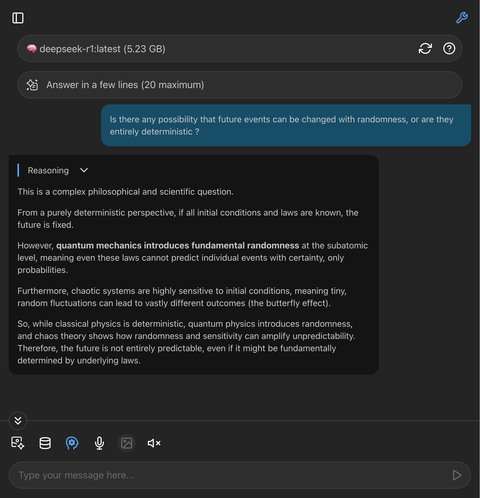
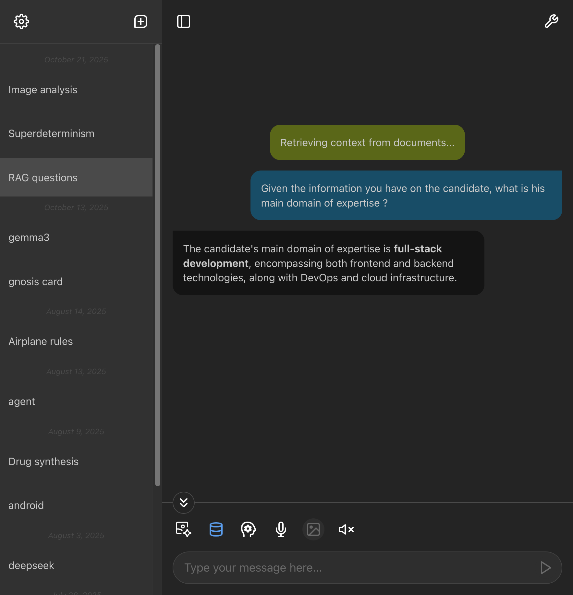
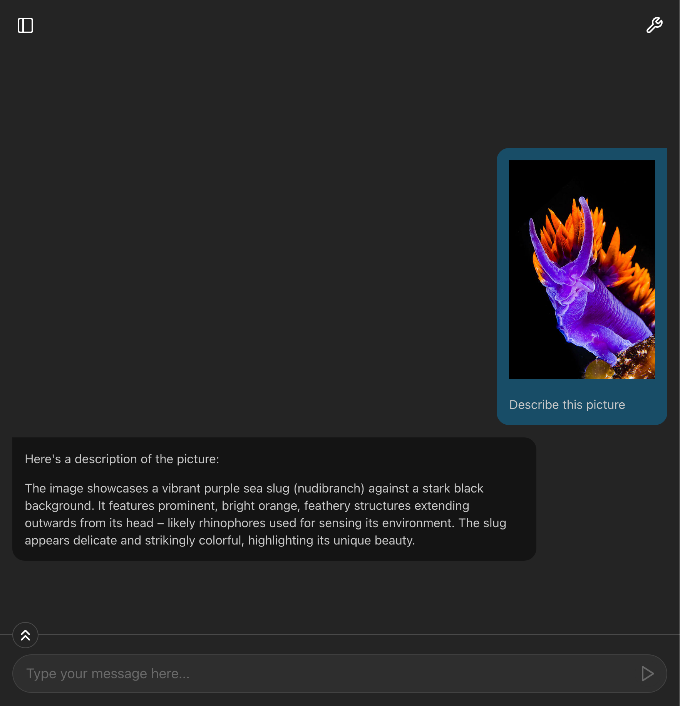
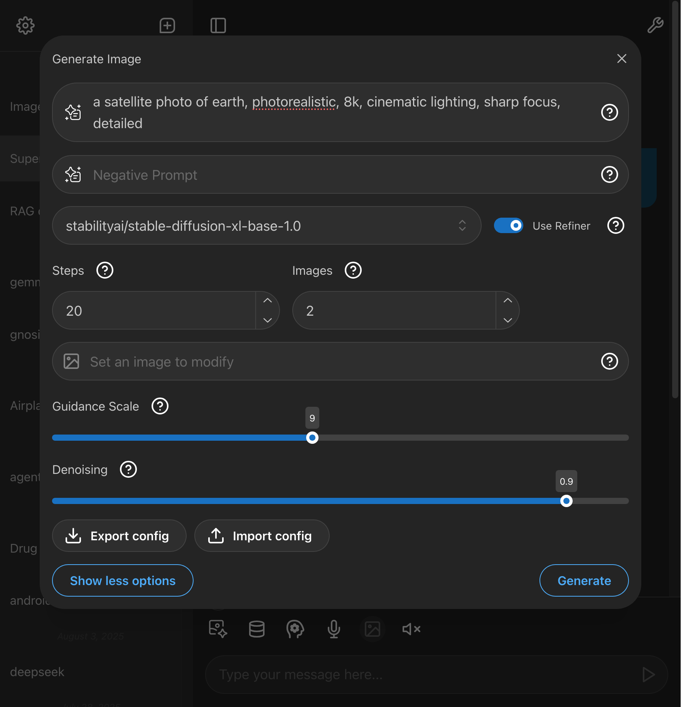

# OllamaChat

`OllamaChat` is an interactive chat UI built with Next.js, React and TypeScript. It talks to any **Ollama** or **LM Studio** server through the OpenAI-compatible `/v1` API, and optionally to [ChatServer](https://github.com/vaccarov/ChatServer) for image generation, speech-to-text, text-to-speech and RAG.

## Screenshots

<table align="center">
  <tr>
    <td></td>
    <td></td>
  </tr>
  <tr>
    <td></td>
    <td></td>
  </tr>
</table>

## Features

- **Chat with Ollama or LM Studio**: model list, capabilities, size and quantisation are read from the native API of whichever server you point at.
- **Multi-session management**: chat history is saved and organised into distinct sessions.
- **Import/Export sessions**: save and restore your chat sessions as JSON.
- **Voice transcription (STT)**: record your voice and have it transcribed as text input.
- **Text-to-speech (TTS)**: model responses can be read aloud.
- **Image generation & analysis**: generate images from text prompts and attach images to your prompts for vision-capable models.
- **Retrieval-Augmented Generation (RAG)**: ground answers in your own PDF documents.
- **Internationalisation (i18n)**: English and French.
- **Markdown & collapsible reasoning**: responses render as Markdown, with `reasoning_content` or `<think>` blocks shown in a collapsible section.

## Tech stack

- **Next.js** (App Router) + **React** + **TypeScript**
- **Mantine** for the component library and `@mantine/hooks` for storage/media-query hooks
- **React Feather** for icons
- **i18next** / **react-i18next** for translations
- **react-markdown** + **rehype-raw** for rendering

## Prerequisites

- **Node.js** 18 or higher
- **npm**
- A running **Ollama** server (`ollama pull mistral`) **or** an **LM Studio** server with the local API enabled
- *(optional)* A running [ChatServer](https://github.com/vaccarov/ChatServer) for image generation, transcription, TTS and RAG

## Installation and startup

```bash
git clone https://github.com/vaccarov/OllamaChat
cd OllamaChat
npm install
npm run dev
```

The application is then available at [http://localhost:3000](http://localhost:3000).

## Configuration

Both server URLs can be set from the in-app **Settings → Servers** tab, or pre-filled with a `.env.local` file (never committed):

```env
NEXT_PUBLIC_OLLAMA_URL=http://localhost:11434
NEXT_PUBLIC_SERVER_URL=http://localhost:8000
```

`NEXT_PUBLIC_OLLAMA_URL` is the **LLM server** and accepts every common spelling:

| Server | Accepted values |
| --- | --- |
| Ollama | `http://localhost:11434`, `http://localhost:11434/api`, `http://localhost:11434/v1` |
| LM Studio | `http://localhost:1234`, `http://localhost:1234/v1` |

The app probes `/api/tags` (Ollama), then `/api/v0/models` (LM Studio), then falls back to the generic OpenAI `/v1/models`.

`NEXT_PUBLIC_SERVER_URL` is the optional **backend server** (ChatServer).

Both values are only a first-run default: whatever you type in Settings is what the app uses, and it is persisted in `localStorage`.

## Development scripts

- `npm run dev` — start the development server
- `npm run build` — compile for production
- `npm run start` — start the production server
- `npm run check` — Biome lint + format + import sorting (writes changes)
- `npm run lint` / `npm run format` — Biome lint / format only

## TODO

- Handle large image uploads (use a local DB instead of `localStorage`).
- Use masks for image generation so that only parts of a picture are edited (inpainting / masked img2img).
- Handle very large images (`Invalid buffer size`).
